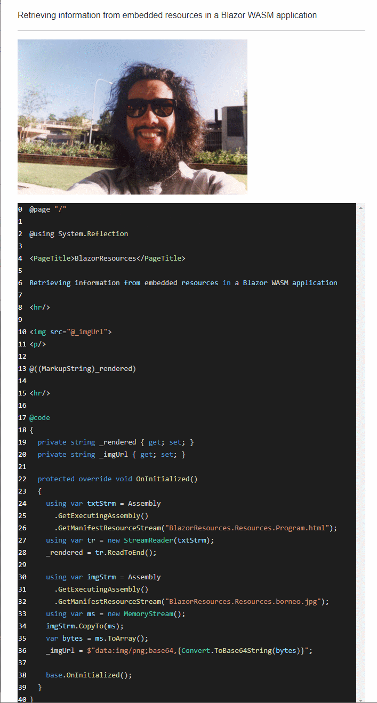

# Blazor + WebAssembly + Embedded Resources
How to load embedded resources from a Blazor WASM assembly



## How it works
### Embed resources
In the project file, make sure all resources are marked as `EmbeddedResource`:

```xml
  <ItemGroup>
    <EmbeddedResource Include="Resources\borneo.jpg" />
    <EmbeddedResource Include="Resources\Program.html" />
  </ItemGroup>
```

This will bind the files into your Blazor WASM assembly.

The files will be automatically downloaded to the browser as part of the WASM.

### Load resources
At runtime, load your resources:

```csharp
    using var txtStrm = Assembly
      .GetExecutingAssembly()
      .GetManifestResourceStream("BlazorResources.Resources.Program.html");
    using var tr = new StreamReader(txtStrm);
    _rendered = tr.ReadToEnd();

    using var imgStrm = Assembly
      .GetExecutingAssembly()
      .GetManifestResourceStream("BlazorResources.Resources.borneo.jpg");
    using var ms = new MemoryStream();
    imgStrm.CopyTo(ms);
    var bytes = ms.ToArray();
    _imgUrl = $"data:img/png;base64,{Convert.ToBase64String(bytes)}";
```
